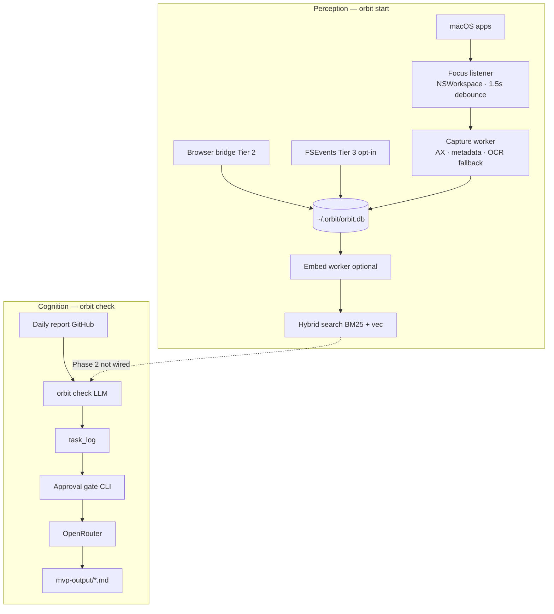

# Orbit context architecture & routing

Visual reference for mentor review. Interactive version: open `orbit-context-routing.canvas.tsx` in Cursor Canvases.

## Key insight (Phase 1 today)

**Capture** and **task detection** are two parallel pipelines:

| Pipeline | Command | Input | Output |
|----------|---------|-------|--------|
| Perception | `orbit start` | App focus → Accessibility API | `~/.orbit/orbit.db` (events + atoms) |
| Cognition | `orbit check` | GitHub daily report or local `.md` | `task_log` + `mvp-output/*.md` |

`orbit check` does **not** read captured atoms yet. Phase 2 wires hybrid search into the orchestrator.

## Routing diagram

Source file: [`diagrams/context-routing.mmd`](diagrams/context-routing.mmd)

## Capture tiers

| Tier | Mode | Default | Stored |
|------|------|---------|--------|
| 0 | Metadata | Fallback | App, bundle, window title |
| 1 | AX text | **On** | UI text atoms |
| 2 | Browser ext | Bridge on | URL, title, selection |
| 3 | FSEvents | Opt-in | Paths + mtimes only |
| 4 | OCR | Opt-in | Vision text, no images |

Policy: `~/.orbit/policy.json`

## Design constraints

- Local-first · no screenshots by default
- Event-driven (not polling)
- Per-app exclusion zones
- Enhanced tiers opt-in
- Human approval before external dispatch

## Roadmap hooks

- **Phase 2:** Retrieval — search over `orbit.db` feeds orchestrator prompt; Kanban UI
- **Phase 3:** MCP agents in sandbox after plan approval
