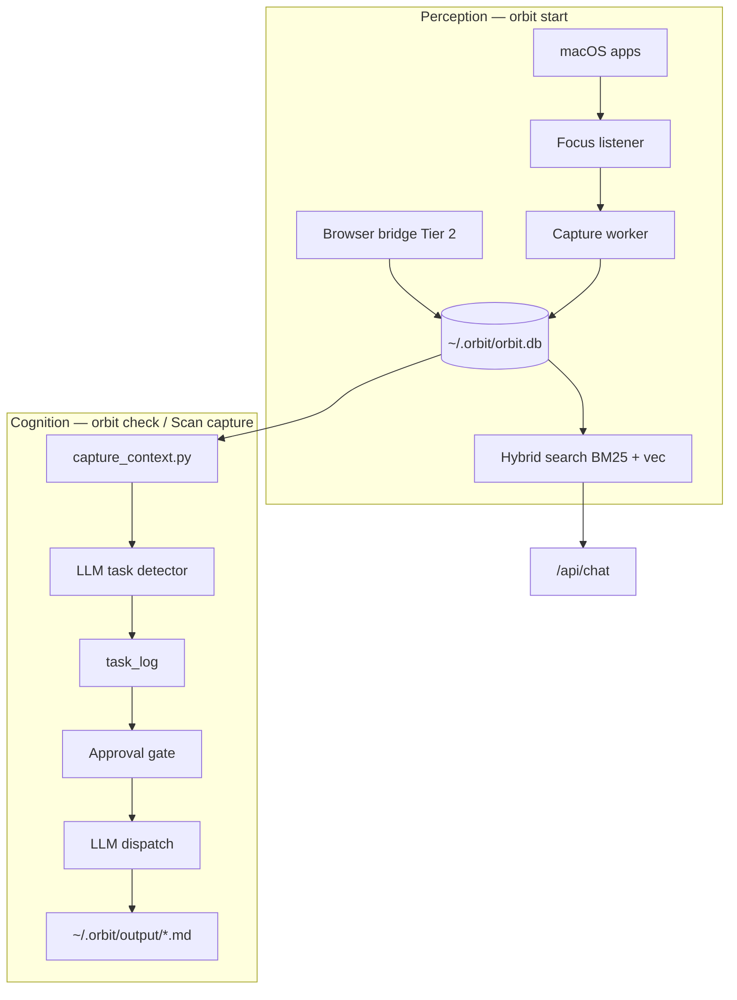

# Orbit context architecture & routing

Visual reference for mentor review. Interactive version: open `orbit-context-routing.canvas.tsx` in Cursor Canvases.

## Key insight (Phase 2 beta)

**Capture** feeds **task detection** by default. Legacy sources (GitHub report, local `.md`) remain available via flags.

| Pipeline | Command / API | Input | Output |
|----------|---------------|-------|--------|
| Perception | `orbit start` / `orbit start --detach` | App focus → Accessibility API | `~/.orbit/orbit.db` (events + atoms) |
| Cognition | `orbit check` (default `--source capture`) | Recent atoms from `orbit.db` | `task_log` + `~/.orbit/output/*.md` |
| App UI | `POST /api/tasks/detect` | Last N hours of capture | `task_log` + Kanban board |

## Routing diagram

Source file: [`diagrams/context-routing.mmd`](diagrams/context-routing.mmd)

## Capture tiers

| Tier | Mode | Default | Stored |
|------|------|---------|--------|
| 0 | Metadata | Fallback | App, bundle, window title |
| 1 | AX text | **On** | UI text atoms |
| 2 | Browser ext | Bridge on | URL, title, selection |
| 3 | FSEvents | Opt-in | Paths + mtimes only |
| 4 | OCR | Opt-in | Vision text, no images |

Policy: `~/.orbit/policy.json`

## Orbit Access App

Native SwiftUI client (`OrbitAccessApp/`). First-run wizard covers Gatekeeper and Accessibility. Sign-in / sign-up gate capture. Kanban task board with **Scan capture** triggers `/api/tasks/detect`.

## Design constraints

- Local-first · no screenshots by default
- Event-driven (not polling)
- Per-app exclusion zones
- Enhanced tiers opt-in
- Human approval before external dispatch

## Roadmap hooks

- **Phase 3:** MCP agents in sandbox after plan approval
- **Future:** SQLCipher encryption, calendar/email/audio sources
